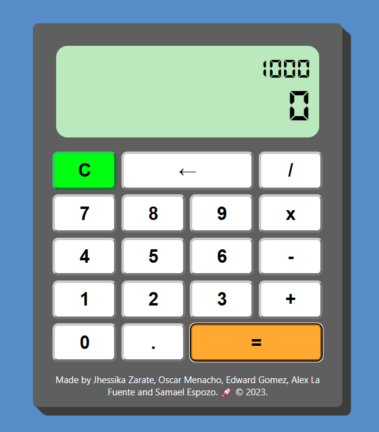

# Calculadora 🧮

Una calculadora web simple creada con HTML, CSS y JavaScript.

## Características 🚀

- Suma ➕, resta ➖, multiplica ✖️ y divide ➗ números.
- Operaciones con decimales 🧮.
- Botón de borrar 🗑️ y retroceder para corregir errores.
- Diseño limpio y agradable 🎨.

## Uso 📝

1. Clona este repositorio o descarga los archivos en tu computadora.
2. Abre el archivo `index.html` en tu navegador web o con la extensión de Live Server. 🌐

¡Disfruta calculando! 🤓